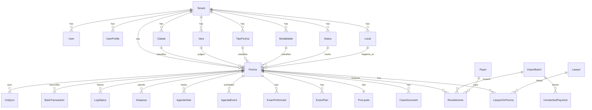

# Data Model Documentation — Pericias Manager Pro

## Visão geral
Modelo relacional multi-tenant centrado em `Pericia`, com trilha de auditoria e suporte a dados clínicos sensíveis (LGPD).

## Diagrama ER (Mermaid)

## Tabelas principais
- `Pericia`: núcleo processual/clínico/financeiro da perícia.
- `User`, `UserProfile`: autenticação, perfil e papel operacional.
- Catálogos (`Cidade`, `Vara`, `TipoPericia`, `Modalidade`, `Status`, `Local`): normalização de filtros.
- `PreLaudo`, `ExamPlan`, `ExamPerformed`: ciclo técnico de produção de laudo.
- `Recebimento`, `Despesa`, `ImportBatch`, `UnmatchedPayment`, `BankTransaction`: controle financeiro e conciliação.
- `LogStatus`, `ActivityLog`: trilhas de auditoria e histórico.

## Decisões de design

### 1) Multi-tenant por `tenantId`
Todas as entidades de domínio possuem `tenantId` para isolamento por perito/conta.

### 2) JSONB em dados clínicos flexíveis
Usado em:
- `PreLaudo.sections`, `PreLaudo.aiAnalysis`, `PreLaudo.laudoV2`, `PreLaudo.laudoRealtime`.
- `PhysicalManeuver.procedure`.
- `Pericia.esclarecimentos` e metadados operacionais.

**Por que JSONB e não tabela separada?**
- Estrutura variável por tipo de perícia.
- Evolução frequente sem migrations disruptivas.
- Melhor velocidade de iteração para IA e templates de laudo.

### 3) Soft delete controlado
- Aplicado em `Pericia`, `Recebimento`, `Despesa` via `deletedAt`.
- Mantém histórico para auditoria e rastreabilidade jurídica.

### 4) N:N explícito para advogados
- `LawyerOnPericia` evita arrays em coluna e preserva integridade relacional.

### 5) Auditoria padrão
- Campos comuns: `createdAt`, `updatedAt`, `createdBy`, `updatedBy`.
- `LogStatus` como trilha imutável (apenas inserção de eventos).

## Índices e consultas críticas
- Chaves de filtro de listagem: `processoCNJ`, `cidadeId`, `statusId`, `dataNomeacao`.
- Índices compostos por `tenantId` para preservar seletividade multi-tenant.
- GIN (JSONB) para busca estrutural em documentos clínicos.
- Trigram para busca textual aproximada em nomes/processo.

## Regras de integridade esperadas
- `tenantId + processoCNJ` único em `Pericia`.
- `UserProfile.userId` único (1:1 com `User`).
- `LawyerOnPericia(tenantId, periciaId, lawyerId)` único.
- `LogStatus` sem update/delete por política RLS.

## Escalabilidade alvo
- Volume esperado: 500–2000 perícias por tenant/perito.
- Estratégia: índices compostos por tenant + soft-delete parcial + JSONB indexado seletivamente.

## Status operacionais (fonte atual do banco)

Os códigos de status usados no cadastro real (`Status`) são:

- `AVALIAR`
- `MAJORAR`
- `AGUARDANDO_ACEITE_HONORARIOS`
- `AGENDAR_DATA`
- `DATA_AGENDADA`
- `AUSENTE`
- `AUSENCIA_INFORMADA`
- `ENVIAR_LAUDO`
- `LAUDO_ENVIADO`
- `ESCLARECIMENTOS`
- `AGUARDANDO_PAG`
- `RECEBIDO_PARCIALMENTE`
- `FINALIZADA`
- `RECUSAR`
- `CANCELADA`
- `TELEPERICIA`
- `FAZER_INDIRETA`

Para a especificação completa do motor de status alinhado a esses códigos, consultar:

- `docs/motor-status-pericias.md`
