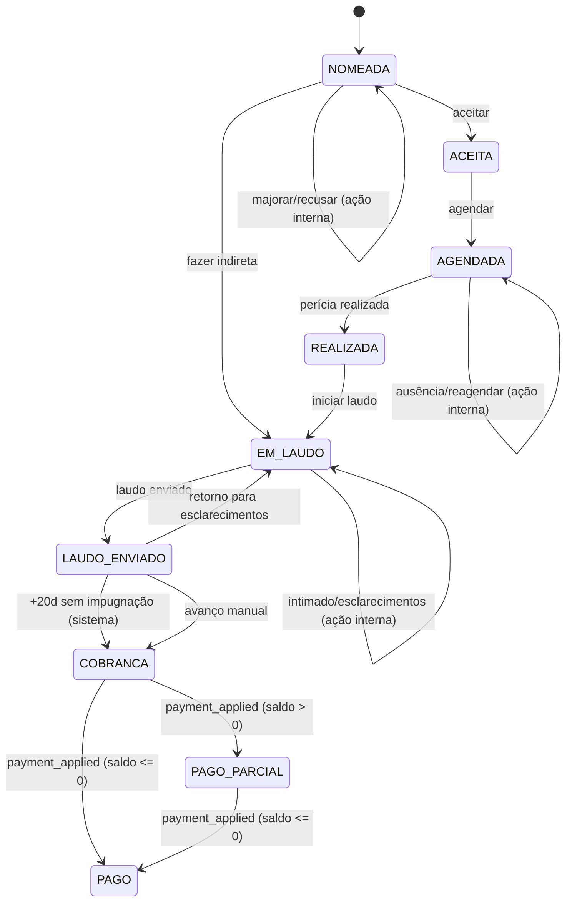

# Motor de Status de Perícias (alinhado ao banco atual)

## 0) Objetivo

Definir um motor único e auditável para o ciclo de vida das perícias **usando os status existentes hoje no banco** (tabela `Status`, seed padrão), sem criar explosão de estados.

Este documento adapta o prompt original para os códigos reais:

- `NOMEADA`
- `ACEITA`
- `AGENDADA`
- `REALIZADA`
- `EM_LAUDO`
- `LAUDO_ENVIADO`
- `COBRANCA`
- `PAGO_PARCIAL`
- `PAGO`

Fonte de verdade atual: `backend/prisma/seed.ts` (bloco `const statuses = [...]`).

---

## 1) Ajustes incorporados (regras já decididas)

### 1.1 “Intimado a enviar laudo” não é status

Permanece como **ação interna** enquanto a perícia está em `EM_LAUDO`.

### 1.2 Urgência não é removida por ações internas

Urgência só é removida por **mudança de status**.

### 1.3 “Aguardando pagamento” é evento financeiro

No banco atual, esse macroestado mapeia para `COBRANCA`.
Mudanças para `PAGO_PARCIAL`/`PAGO` devem vir de `payment_applied` (módulo financeiro), com log.

---

## 2) Enums oficiais (versão alinhada ao banco)

## 2.1 Status macro único (DB real)

```ts
export enum PericiaStatusDb {
  NOMEADA = "NOMEADA",
  ACEITA = "ACEITA",
  AGENDADA = "AGENDADA",
  REALIZADA = "REALIZADA",
  EM_LAUDO = "EM_LAUDO",
  LAUDO_ENVIADO = "LAUDO_ENVIADO",
  COBRANCA = "COBRANCA",
  PAGO_PARCIAL = "PAGO_PARCIAL",
  PAGO = "PAGO"
}
```

### 2.2 Modalidade (campo paralelo)

Sem alteração funcional de regra (continua campo paralelo).

> Observação prática: no cadastro base também existe `hibrida` em `Modalidade`.

---

## 3) Mapeamento do prompt original → status reais do banco

| Macro do prompt | Status real (DB) | Observação |
|---|---|---|
| `AVALIAR` | `NOMEADA` | Triagem inicial da nomeação |
| `MAJORAR` | `NOMEADA` (com flag/ação) | Não há status próprio no DB atual |
| `AGUARDANDO_ACEITE_HONORARIOS` | `ACEITA` (ou `NOMEADA` + flag, conforme decisão) | Precisa regra de negócio final |
| `AGENDAR_DATA` | `ACEITA` | Etapa “pronto para agendar” sem status separado |
| `DATA_AGENDADA` | `AGENDADA` | DB possui apenas “agendada” |
| `AUSENTE` | `AGENDADA` + ocorrência/ação interna | Não existe status dedicado |
| `AUSENCIA_INFORMADA` | `AGENDADA` + ocorrência/ação interna | Não existe status dedicado |
| `ENVIAR_LAUDO` | `EM_LAUDO` | Equivalente direto |
| `LAUDO_ENVIADO` | `LAUDO_ENVIADO` | Equivalente direto |
| `ESCLARECIMENTOS` | `EM_LAUDO` + motivo de retorno | Sem status dedicado |
| `AGUARDANDO_PAGAMENTO` | `COBRANCA` | Equivalente financeiro |
| `RECEBIDA_PARCIALMENTE` | `PAGO_PARCIAL` | Equivalente financeiro |
| `FINALIZADA` | `PAGO` | Equivalente financeiro |
| `RECUSADA` | **sem status no DB atual** | Tratar via ação + log (ou criar status depois) |
| `CANCELADA` | **sem status no DB atual** | Tratar via ação + log (ou criar status depois) |

---

## 4) Campos paralelos obrigatórios (mantidos)

Os campos transversais de urgência, prazos, agendamento, teleperícia, laudo e financeiro continuam válidos como no prompt original.

Pontos de ajuste por banco atual:

1. Campos que substituem status inexistente (`AUSENTE`, `ESCLARECIMENTOS`, `RECUSADA`, `CANCELADA`) devem ser representados por:
   - flags/campos de domínio; e
   - logs em `pericia_action_log`.
2. `EM_LAUDO` concentra “produção de laudo”, “intimação para laudo” e “esclarecimentos”, com subtipo no payload de ação.

---

## 5) Matriz oficial (status DB → ações recomendadas → efeitos)

## 5.1 `NOMEADA`

Ações recomendadas:

- Aceitar perícia → `ACEITA`
- Definir proposta/majorar (ação interna auditável)
- Fazer indireta → `EM_LAUDO` (payload `{ origem: "INDIRETA" }`)
- Recusar (ação interna auditável, sem status dedicado no DB atual)

## 5.2 `ACEITA`

Ações recomendadas:

- Agendar (data/hora/local) → `AGENDADA`
- Ajustar modalidade (ação interna)
- Cancelar fluxo (ação interna auditável enquanto não há status `CANCELADA`)

## 5.3 `AGENDADA`

Ações recomendadas:

- Marcar realização → `REALIZADA`
- Registrar ausência (ação interna, com motivo)
- Reagendar (permanece `AGENDADA`, atualiza data/hora/local)

## 5.4 `REALIZADA`

Ações recomendadas:

- Iniciar elaboração de laudo → `EM_LAUDO`

## 5.5 `EM_LAUDO`

Ações recomendadas:

- Intimado a enviar laudo (ação interna; ativa urgência)
- Registrar esclarecimentos (ação interna)
- Enviar laudo → `LAUDO_ENVIADO`

## 5.6 `LAUDO_ENVIADO`

Automação:

- Após +20 dias sem impugnação → `COBRANCA` (origem `SISTEMA`)

Ações recomendadas:

- Retornar para esclarecimentos (ação interna + opcional retorno para `EM_LAUDO`)
- Avançar manualmente para `COBRANCA` quando aplicável

## 5.7 `COBRANCA`

Somente evento financeiro altera status:

- `payment_applied` com saldo > 0 → `PAGO_PARCIAL`
- `payment_applied` com saldo <= 0 → `PAGO`

## 5.8 `PAGO_PARCIAL`

Novo `payment_applied`:

- saldo <= 0 → `PAGO`

## 5.9 `PAGO`

Estado final operacional.

---

## 6) Auditoria obrigatória

## 6.1 Log de mudança de status (imutável)

`pericia_status_log` com campos mínimos do prompt original.

## 6.2 Log de ações internas

`pericia_action_log` para: urgência, modalidade, teleperícia, intimação de laudo, ausência, majorar, recusa/cancelamento enquanto sem status dedicado.

---

## 7) Regras de UI (obrigatórias)

1. Urgência sempre no cabeçalho.
2. Dropdown de status sempre disponível com modal obrigatório quando necessário.
3. Botões de resolução recomendada por status DB atual.
4. Itens sem status dedicado (ausência, esclarecimento, recusa, cancelamento) aparecem como badge/etiqueta secundária baseada em ações/logs.

---

## 8) Diagrama final (Mermaid, alinhado ao banco)



---

## 9) Checklist de endpoints (adaptado)

### Backend

- `POST /pericias/:id/status`
  - valida payload obrigatório por status destino
  - persiste campos complementares
  - cria `pericia_status_log`
  - se mudou status: resolve urgência automaticamente

- `POST /pericias/:id/urgencia`
  - marcar/desmarcar urgente
  - ao marcar: prazo obrigatório
  - log em `pericia_action_log`

- `POST /pericias/:id/modalidade`
  - alterna modalidade
  - log ação

- `POST /pericias/:id/telepericia`
  - salva responsável
  - log ação

- `POST /pericias/:id/intimacao-laudo`
  - marca intimado + prazo
  - ativa urgência
  - log ação

- Job periódico:
  - `LAUDO_ENVIADO` + 20 dias → `COBRANCA` (`origem=SISTEMA`)

- Listener financeiro:
  - `payment_applied` → recalcula saldo → `PAGO_PARCIAL`/`PAGO` com log

### Frontend

- Header com urgência
- Dropdown de status com modais obrigatórios
- Resoluções recomendadas por status DB
- Lote de agendamento atualiza para `AGENDADA`

---

## 10) Dúvidas em aberto (precisam decisão)

1. `MAJORAR` deve ficar como ação interna em `NOMEADA` ou virar novo status cadastrado?
2. `RECUSADA` e `CANCELADA` serão criados na tabela `Status` ou permanecem apenas como ação auditável?
3. `AGUARDANDO_ACEITE_HONORARIOS` deve ser uma subetapa de `NOMEADA` (flag) ou usar `ACEITA` como etapa intermediária operacional?

Enquanto não houver decisão, este documento considera a abordagem **sem criar novos status no banco**.
