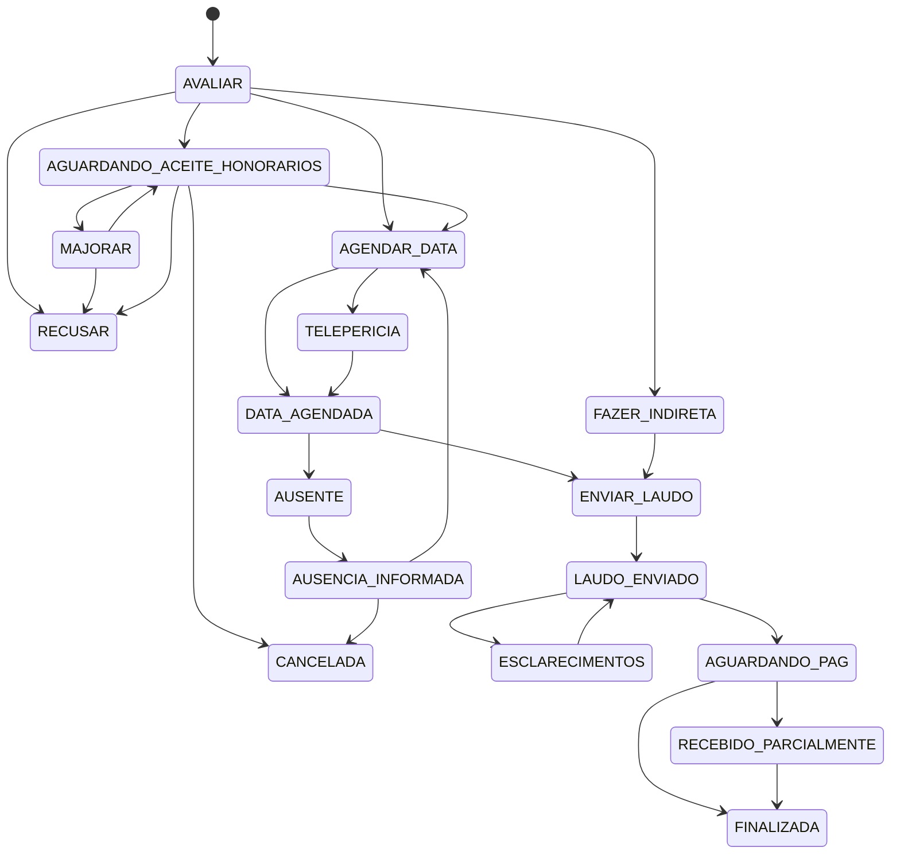

# Motor de Status de Perícias (alinhado ao banco real)

## 0) Objetivo

Definir um motor único e auditável para o ciclo de vida das perícias, **sem divergência com os códigos hoje cadastrados na tabela `Status` do banco**.

## 1) Fonte de verdade de status (DB real)

Conforme base real compartilhada (print da tabela), os códigos ativos são:

- `AVALIAR`
- `MAJORAR`
- `AGUARDANDO_ACEITE_HONORARIOS`
- `AGENDAR_DATA`
- `DATA_AGENDADA`
- `AUSENTE`
- `AUSENCIA_INFORMADA`
- `ENVIAR_LAUDO`
- `LAUDO_ENVIADO`
- `ESCLARECIMENTOS`
- `AGUARDANDO_PAG`
- `RECEBIDO_PARCIALMENTE`
- `FINALIZADA`
- `RECUSAR`
- `CANCELADA`
- `TELEPERICIA`
- `FAZER_INDIRETA`

> Observação: este documento substitui a versão anterior que estava baseada nos códigos do `seed.ts` local e não no cadastro real do banco em uso.

---

## 2) Enum oficial (alinhado ao banco)

```ts
export enum PericiaStatus {
  AVALIAR = "AVALIAR",
  MAJORAR = "MAJORAR",
  AGUARDANDO_ACEITE_HONORARIOS = "AGUARDANDO_ACEITE_HONORARIOS",

  AGENDAR_DATA = "AGENDAR_DATA",
  DATA_AGENDADA = "DATA_AGENDADA",

  AUSENTE = "AUSENTE",
  AUSENCIA_INFORMADA = "AUSENCIA_INFORMADA",

  ENVIAR_LAUDO = "ENVIAR_LAUDO",
  LAUDO_ENVIADO = "LAUDO_ENVIADO",
  ESCLARECIMENTOS = "ESCLARECIMENTOS",

  AGUARDANDO_PAG = "AGUARDANDO_PAG",
  RECEBIDO_PARCIALMENTE = "RECEBIDO_PARCIALMENTE",
  FINALIZADA = "FINALIZADA",

  RECUSAR = "RECUSAR",
  CANCELADA = "CANCELADA",

  TELEPERICIA = "TELEPERICIA",
  FAZER_INDIRETA = "FAZER_INDIRETA"
}
```

---

## 3) Regras estruturais (mantidas)

### 3.1 “Intimado a enviar laudo” não é status

- Continua como ação interna em `ENVIAR_LAUDO`.
- Deve registrar prazo de intimação e log de ação.
- Deve ativar urgência automaticamente.

### 3.2 Urgência não é removida por ação interna

Urgência só é removida em mudança de status.

### 3.3 Financeiro governa conclusão de pagamento

A evolução entre `AGUARDANDO_PAG` → `RECEBIDO_PARCIALMENTE`/`FINALIZADA` deve ocorrer por evento financeiro (`payment_applied`) com log.

---

## 4) Campos paralelos obrigatórios

Mantidos os campos de:

- urgência (`isUrgente`, `prazoUrgente`, etc.)
- prazos operacionais (`prazoAgendamentoDias`, `prazoIndiretaDias`, `prazoEsclarecimentosDias`, `prazoIntimacaoLaudoDias`)
- agendamento (`agendamentoData`, `agendamentoHora`, `agendamentoLocal`, `agendamentoOrigem`)
- teleperícia (responsável/telefone)
- laudo (`dataRealizacaoPericia`, `dataEnvioLaudo`, observações)
- financeiro (total, recebido, saldo)

---

## 5) Matriz oficial — Status → Ações → Efeitos

### 5.1 `AVALIAR`

- Agendar data → `AGENDAR_DATA` (com modal de prazo + modalidade)
- Aguardar aceite de honorários → `AGUARDANDO_ACEITE_HONORARIOS`
- Fazer indireta → `FAZER_INDIRETA` (com prazo de indireta)
- Recusar → `RECUSAR`

### 5.2 `MAJORAR`

- Aguardando aceite honorários → `AGUARDANDO_ACEITE_HONORARIOS`
- Recusar → `RECUSAR`

### 5.3 `AGUARDANDO_ACEITE_HONORARIOS`

- Agendar data → `AGENDAR_DATA`
- Majorrar/contraproposta → `MAJORAR`
- Recusar → `RECUSAR`
- Cancelar → `CANCELADA`

### 5.4 `AGENDAR_DATA`

- Agendada → `DATA_AGENDADA`
- Teleperícia (troca operacional) → `TELEPERICIA`

### 5.5 `TELEPERICIA`

- Inserir dados de teleperícia (ação interna com log)
- Confirmar agendamento → `DATA_AGENDADA`

### 5.6 `DATA_AGENDADA`

- Perícia realizada → `ENVIAR_LAUDO`
- Ausente → `AUSENTE`

### 5.7 `AUSENTE`

- Ausência informada → `AUSENCIA_INFORMADA`

### 5.8 `AUSENCIA_INFORMADA`

- Agendar data novamente → `AGENDAR_DATA`
- Cancelar → `CANCELADA`

### 5.9 `FAZER_INDIRETA`

- Produção e envio de laudo indireto dentro do fluxo de laudo
- Transição recomendada: `FAZER_INDIRETA` → `ENVIAR_LAUDO`

### 5.10 `ENVIAR_LAUDO`

- Intimado a enviar laudo (ação interna; não muda status)
- Laudo enviado → `LAUDO_ENVIADO`

### 5.11 `LAUDO_ENVIADO`

- Esclarecimentos → `ESCLARECIMENTOS`
- Sem impugnação (manual/automação +20d) → `AGUARDANDO_PAG`

### 5.12 `ESCLARECIMENTOS`

- Esclarecimentos enviados → `LAUDO_ENVIADO`

### 5.13 `AGUARDANDO_PAG`

- Evento financeiro com saldo > 0 → `RECEBIDO_PARCIALMENTE`
- Evento financeiro com saldo <= 0 → `FINALIZADA`

### 5.14 `RECEBIDO_PARCIALMENTE`

- Novo evento financeiro com saldo <= 0 → `FINALIZADA`

### 5.15 Status de encerramento

- `FINALIZADA`, `RECUSAR`, `CANCELADA` permanecem consultáveis em “Todas as perícias” e busca.

---

## 6) Auditoria obrigatória

### 6.1 `pericia_status_log` (imutável)

Campos mínimos:

- `id`
- `periciaId`
- `statusAnterior`
- `statusNovo`
- `dataMudanca`
- `usuarioId`
- `origemMudanca` (`DROPDOWN` | `BOTAO` | `SISTEMA` | `LOTE`)
- `payload` (JSON)

### 6.2 `pericia_action_log`

Para ações internas:

- urgência
- teleperícia
- modalidade
- intimação de laudo
- observações relevantes

---

## 7) Regras de UI

1. Checkbox “Urgente” sempre no cabeçalho (com modal de prazo ao marcar).
2. Dropdown de status sempre disponível com validação de modal obrigatório.
3. Botões de “Resoluções recomendadas” dinâmicos por status.
4. Mudança de status sempre gera log e resolve urgência automaticamente.

---

## 8) Diagrama (Mermaid)



---

## 9) Checklist de endpoints

### Backend

- `POST /pericias/:id/status`
- `POST /pericias/:id/urgencia`
- `POST /pericias/:id/modalidade`
- `POST /pericias/:id/telepericia`
- `POST /pericias/:id/intimacao-laudo`
- Job de evolução automática de `LAUDO_ENVIADO` para `AGUARDANDO_PAG`
- Listener financeiro `payment_applied` para parcial/finalização

### Frontend

- Header com urgência
- Dropdown de status com modais obrigatórios
- Botões de resolução por status
- Atualização em lote para agendamento
